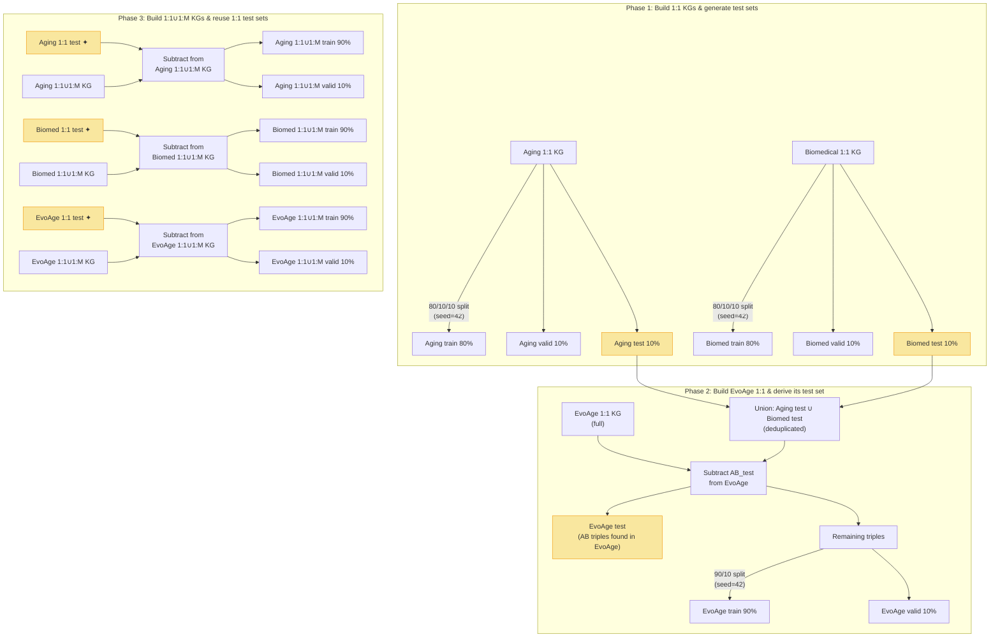

##### # 06 — Final KG Building & Train/Valid/Test Splitting
> 📂 **Source Code & Notebooks:** [pipeline/06_tensor_building](https://github.com/the-ahuja-lab/EvoAge/tree/main/pipeline/06_tensor_building)


## 1. Purpose

This is **Step 6** of the EvoAge Knowledge Graph (KG) construction pipeline. The goal is to convert all processed triple files into **integer-mapped PyTorch tensors** and produce reproducible **train / valid / test splits** for three KG variants: **Aging**, **Biomedical**, and **EvoAge** (the union of both). Each variant is built in two ortholog configurations (1:1 and 1:1∪1:M), yielding **6 final KGs**. The critical design requirement is that the **test set from the 1:1 KG is used to evaluate both the 1:1 and 1:1∪1:M versions** of the same KG variant — ensuring fair, leak-free comparison.

---

## 2. Overview

### The 6 Final KGs

| KG Variant | Ortholog config | Sources |
|---|---|---|
| **Aging 1:1** | `ortholog_one2one` | `Aging_specific/` Human + 1:1 species files |
| **Aging 1:1∪1:M** | `one2one + one2many` | `Aging_specific/` Human + 1:1∪1:M species files |
| **Biomedical 1:1** | `ortholog_one2one` | `Biomedical/` Human + 1:1 species files |
| **Biomedical 1:1∪1:M** | `one2one + one2many` | `Biomedical/` Human + 1:1∪1:M species files |
| **EvoAge 1:1** | `ortholog_one2one` | ALL generalised/ Human + 1:1 species + species connections |
| **EvoAge 1:1∪1:M** | `one2one + one2many` | ALL generalised/ Human + 1:1∪1:M species + species connections |

### Shared Global Mappings

All 6 KGs share the **same node-to-integer and relation-to-integer mappings**, built from the EvoAge 1:1∪1:M KG (the largest superset). This ensures that node ID `42` always refers to the same entity across all KGs, enabling direct comparison.

---

## 3. Test Set Flow — The Core Logic

> [!IMPORTANT]
> The test set design is the most critical part of this step. It ensures that when comparing the 1:1 KG against the 1:1∪1:M KG, the evaluation is fair — the same test triples are used for both, and every test triple is guaranteed to exist in both KGs.

### How test sets are generated and reused



**✦ = same test set reused** — the 1:1 test is subtracted from the 1:1∪1:M KG so the remaining triples become train+valid.

### Why this works

1. **1:1 KG is a subset of 1:1∪1:M KG** (guaranteed by construction in Step 04). Therefore every triple in the 1:1 test set also exists in the 1:1∪1:M KG.
2. By subtracting the 1:1 test set from the 1:1∪1:M KG, we ensure:
   - The **test set is identical** for both configurations → fair comparison
   - No test triple leaks into the train/valid sets of the 1:1∪1:M KG
3. The remaining triples (after subtraction) are split into train (90%) and valid (10%).

> [!WARNING]
> If separate test sets were drawn for the 1:1 and 1:1∪1:M KGs, some 1:1∪1:M test triples would involve genes that don't exist in the 1:1 KG — making the 1:1 KG's performance artificially worse (evaluating on nodes it has never seen). The shared-test-set approach avoids this bias entirely.

---

## 4. Pipeline — Step-by-Step

### 4.0. Pre-step — Build Global Mappings (node IDs + relation IDs)

📄 **Script**: [01.py](file:///storage/Arushi/090526_EvoAge/kg_formation/DOCUMENTATION/final_kg_building_06/01.py)

**What it does:**
- Reads **all** source files (Human + all species + species connections) for the EvoAge 1:1∪1:M KG (the largest superset)
- Extracts every unique `head` and `tail` value → builds a global `node → integer` mapping
- Extracts every unique `relation` value → builds a `relation → integer` mapping
- Uses parallel processing (8 workers) with streaming batches (2M rows) to handle files up to 25 GB
- Saves mappings as `node_id_mapping_EvoAge_121_12M.pkl` and `relation_id_EvoAge_EvoAge_121_12M.csv`

**Key detail:** The mapping is built from the **largest KG** so that every node/relation across all 6 KGs gets a consistent integer ID. Smaller KGs (Aging, Biomedical) reuse these same mappings — they just use a subset of the IDs.

**Outputs:**
- `node_id_mapping_EvoAge_121_12M.pkl` — DataFrame with `[Node, MappedID]`
- `relation_id_EvoAge_EvoAge_121_12M.csv` — CSV with `[Relation, MappedID]`

---

### 4.1. Build Aging KGs

#### Run 1 — Aging 1:1 KG (build + 80/10/10 split)

📄 **Script**: [Run_1_Aging_1_to_1.py](file:///storage/Arushi/090526_EvoAge/kg_formation/DOCUMENTATION/final_kg_building_06/building_aging_kg_new_02/Run_1_Aging_1_to_1.py)

**What it does:**
1. Loads the global node + relation mappings
2. Reads all files from `Aging_specific/` (Human parquets + `*_ortho_1_to_1.csv` species files)
3. Maps every (head, relation, tail) triple to integer IDs → PyTorch tensor `[N, 3]`
4. Deduplicates using bijective int64 encoding
5. Saves full KG → `Aging_specific_1_to_1_KG.pt`
6. **Splits 80/10/10** with seed=42:
   - `Aging_specific_1to1_KG_train_80.pt` / `.txt`
   - `Aging_specific_1to1_KG_valid_10.pt` / `.txt`
   - `Aging_specific_1to1_KG_test_10.pt` / `.txt` ← **this test set is reused for 1:1∪1:M**

#### Run 2 — Aging 1:1∪1:M KG (build + subtract 1:1 test)

📄 **Script**: [Run_2_Aging_121_12M.py](file:///storage/Arushi/090526_EvoAge/kg_formation/DOCUMENTATION/final_kg_building_06/building_aging_kg_new_02/Run_2_Aging_121_12M.py)

**What it does:**
1. Builds the Aging 1:1∪1:M KG tensor from `Aging_specific/` (Human + `*_ortho_1_to_one2one_plus_one2many.csv`)
2. Loads the **1:1 test set** (`Aging_specific_1to1_KG_test_10.pt`)
3. **Subtracts** the test triples from the 1:1∪1:M KG
4. Splits the remaining triples 90/10 → train/valid
5. Saves:
   - `Aging_specific_121_12M_KG_train_90.pt` / `.txt`
   - `Aging_specific_121_12M_KG_valid_10.pt` / `.txt`
   - Test set = `Aging_specific_1to1_KG_test_10.pt` (same file, reused)

---

### 4.2. Build Biomedical KGs

#### Run 1 — Biomedical 1:1 KG (build + 80/10/10 split)

📄 **Script**: [Run_1_Biomedical_1_to_1.py](file:///storage/Arushi/090526_EvoAge/kg_formation/DOCUMENTATION/final_kg_building_06/building_biomedical_kg_new_03/Run_1_Biomedical_1_to_1.py)

**Same pattern as Aging Run 1**, but reads from `Biomedical/` (Human + species 1:1 files).

#### Run 2 — Biomedical 1:1∪1:M KG (build + subtract 1:1 test)

📄 **Script**: [Run_2_Biomedical_121_12M.py](file:///storage/Arushi/090526_EvoAge/kg_formation/DOCUMENTATION/final_kg_building_06/building_biomedical_kg_new_03/Run_2_Biomedical_121_12M.py)

**Same pattern as Aging Run 2** — subtracts Biomedical 1:1 test, splits remaining 90/10.

---

### 4.3. Build EvoAge KGs

#### Run 1 — EvoAge 1:1 KG (build + derive test from Aging ∪ Biomedical tests)

📄 **Script**: [Run_1_EvoAge_1_to_1.py](file:///storage/Arushi/090526_EvoAge/kg_formation/DOCUMENTATION/final_kg_building_06/building_evoage_kg_new_04/Run_1_EvoAge_1_to_1.py)

**This is the most complex split.** The EvoAge KG is the union of ALL data, so its test set must be derived from the Aging and Biomedical test sets:

1. Builds the EvoAge 1:1 KG tensor from ALL generalised/ Human files + all species `*_ortho_1_to_1.csv` + species connection parquets
2. Loads both **Aging 1:1 test** and **Biomedical 1:1 test**
3. **Unions** them → `AB_test` (deduplicated)
4. **Subtracts** AB_test from the full EvoAge KG (chunked, RAM-safe with 50M-row chunks)
   - Triples found in EvoAge that match AB_test → **EvoAge test set**
   - Remaining triples → train + valid pool
5. Shuffles remaining with seed=42, splits 90/10 → train/valid
6. **Asserts `train + valid + test == N_full`** (exact sum check)
7. Saves:
   - `EvoAge_1to1_KG_train_90.pt` / `.txt`
   - `EvoAge_1to1_KG_valid_10.pt` / `.txt`
   - `EvoAge_1to1_KG_test.pt` / `.txt`

> [!NOTE]
> Some AB_test triples may NOT be found in the EvoAge KG (if deduplication at the triple level removed them). These are logged as `AB NOT in EvoAge (dropped)` and excluded from the EvoAge test set.

#### Run 2 — EvoAge 1:1∪1:M KG (subtract 1:1 test, split remaining)

📄 **Script**: [Run_2_EvoAge_121_12M.py](file:///storage/Arushi/090526_EvoAge/kg_formation/DOCUMENTATION/final_kg_building_06/building_evoage_kg_new_04/Run_2_EvoAge_121_12M.py)

**What it does:**
1. Loads the EvoAge 1:1∪1:M full KG (`EvoAge_121_12M_to_many_KG.pt`)
2. Loads the **EvoAge 1:1 test** (`EvoAge_1to1_KG_test.pt`)
3. Subtracts test triples from the 1:1∪1:M KG (chunked)
4. Splits remaining 90/10 (stochastic per-row assignment with seed=42)
5. Saves:
   - `EvoAge_121_12M_KG_train_90.pt` / `.txt`
   - `EvoAge_121_12M_KG_valid_10.pt` / `.txt`
   - Test set = `EvoAge_1to1_KG_test.pt` / `.txt` (same file, reused)

Also generates final training-format files:
- `entities_final.dict` — tab-separated `MappedID → Node` mapping
- `relation_final.dict` — tab-separated `MappedID → Relation` mapping

---

## 5. Split Summary Table

| KG Variant | Split | Source of test set | Split ratio |
|---|---|---|---|
| **Aging 1:1** | 80/10/10 random | Self (random split) | 80 train / 10 valid / 10 test |
| **Aging 1:1∪1:M** | Subtract 1:1 test → 90/10 | Aging 1:1 test | 90 train / 10 valid / test from 1:1 |
| **Biomedical 1:1** | 80/10/10 random | Self (random split) | 80 train / 10 valid / 10 test |
| **Biomedical 1:1∪1:M** | Subtract 1:1 test → 90/10 | Biomedical 1:1 test | 90 train / 10 valid / test from 1:1 |
| **EvoAge 1:1** | Subtract AB_test → 90/10 | Union(Aging 1:1 test, Biomed 1:1 test) | 90 train / 10 valid / AB test |
| **EvoAge 1:1∪1:M** | Subtract 1:1 test → 90/10 | EvoAge 1:1 test | 90 train / 10 valid / test from 1:1 |

---

## 6. Output Directory Structure

```
final_kg_building_2/
│
├── building_aging_kg_new/
│   └── Store_House/
│       ├── Aging_specific_1_to_1_KG.pt              ← full 1:1 KG
│       ├── Aging_specific_1to1_KG_train_80.pt|.txt  ← 1:1 train
│       ├── Aging_specific_1to1_KG_valid_10.pt|.txt  ← 1:1 valid
│       ├── Aging_specific_1to1_KG_test_10.pt|.txt   ← 1:1 test (REUSED)
│       ├── Aging_specific_121_12M_KG.pt              ← full 1:1∪1:M KG
│       ├── Aging_specific_121_12M_KG_train_90.pt|.txt
│       ├── Aging_specific_121_12M_KG_valid_10.pt|.txt
│
├── building_biomedical_kg_new/
│   └── Store_House/
│       ├── Biomedical_1_to_1_KG.pt                   ← full 1:1 KG
│       ├── Biomedical_1to1_KG_train_80.pt|.txt
│       ├── Biomedical_1to1_KG_valid_10.pt|.txt
│       ├── Biomedical_1to1_KG_test_10.pt|.txt        ← 1:1 test (REUSED)
│       ├── Biomedical_121_12M_KG.pt                   ← full 1:1∪1:M KG
│       ├── Biomedical_121_12M_KG_train_90.txt
│       ├── Biomedical_121_12M_KG_valid_10.txt
│
├── building_evoage_kg_new/
│   └── Store_House/
│       ├── node_id_mapping_EvoAge_121_12M.pkl         ← GLOBAL node mapping
│       ├── relation_id_EvoAge_EvoAge_121_12M.csv      ← GLOBAL relation mapping
│       ├── EvoAge_1_to_1_KG.pt                        ← full 1:1 KG
│       ├── EvoAge_1to1_KG_train_90.pt|.txt
│       ├── EvoAge_1to1_KG_valid_10.pt|.txt
│       ├── EvoAge_1to1_KG_test.pt|.txt                ← derived from Aging∪Biomed test
│       ├── EvoAge_121_12M_to_many_KG.pt               ← full 1:1∪1:M KG
│       ├── EvoAge_121_12M_KG_train_90.pt|.txt
│       ├── EvoAge_121_12M_KG_valid_10.pt|.txt
│       ├── entities_final.dict
│       └── relation_final.dict
```

---

## 7. Technical Implementation Details

### Bijective int64 encoding for deduplication

Rather than using `torch.unique(dim=0)` (O(N²) memory for large tensors), the pipeline encodes each `(head, relation, tail)` triple as a single `int64`:

```
encoded = head × (R × T) + relation × T + tail
```

where R = max_relation_id + 1, T = max_tail_id + 1. This reduces dedup to `torch.unique()` on a 1-D tensor — orders of magnitude faster for billion-scale KGs. An overflow check ensures this fits within int64 range.

### Chunked subtract for RAM safety

The EvoAge KG has ~1.2B+ triples. Subtracting the test set uses a **sorted-searchsorted** approach:
1. Sort the (small) test keys once
2. Stream the (large) KG in 50M-row chunks
3. For each chunk: `searchsorted` + equality check → boolean mask
4. Accumulate kept/removed parts without holding the full tensor

### Reproducibility

| Parameter | Value |
|---|---|
| Random seed | `42` (for `torch.manual_seed`, `np.random.seed`, `torch.Generator`) |
| Split method | `torch.randperm` with fixed generator |
| Ensembl release | e114 (inherited from Step 04) |
| Output format | `.pt` (PyTorch tensor) + `.txt` (tab-separated integers, PyKEEN-compatible) |

---

## 8. Key Design Decisions

1. **Single global mapping**: All 6 KGs share the same node/relation IDs, built from the largest KG (EvoAge 1:1∪1:M). This means Aging KG node 42 = Biomedical KG node 42 = EvoAge KG node 42.

2. **Test set hierarchy**: Aging and Biomedical get their own 80/10/10 split. EvoAge's test set is the **union** of the Aging and Biomedical test sets (since EvoAge = Aging ∪ Biomedical ∪ generalised). This avoids generating a separate EvoAge test set that might overlap with already-evaluated Aging/Biomedical triples.

3. **1:1∪1:M gets 90/10 (no separate test)**: Since the 1:1 test set is subtracted first, the remaining pool only needs a train/valid split (90/10). The test set is always the 1:1 test — this is the whole point of the design.

4. **Unmapped triples audited**: Any triple whose head/tail/relation is not in the global mapping is logged to `unmapped_triples_*.csv` for debugging, not silently dropped.

5. **Sum-check assertion**: After splitting, the code asserts `len(train) + len(valid) + len(test) == len(full_KG)` to guarantee no triples are lost or duplicated.

---

## 9. Next Step

→ **[Step 07 — Training](file:///storage/Arushi/090526_EvoAge/kg_formation/DOCUMENTATION/Training_07)**: Train KG embedding models (e.g., TransE, RotatE, ComplEx) on the train/valid/test splits using PyKEEN or equivalent frameworks.
