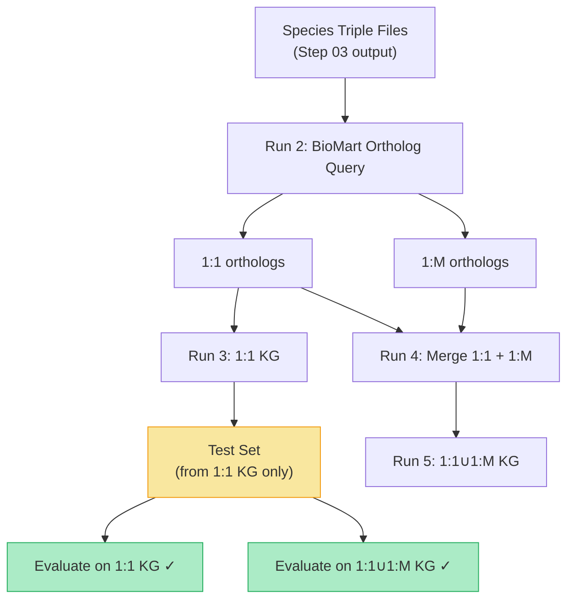

# Step 04 — Orthology Mapping (Non-Human → Human)

## 1. Purpose

This is **Step 4** of the EvoAge Knowledge Graph (KG) construction pipeline. The goal is to convert all non-human species gene nodes to their **human ortholog equivalents** so that data from five model organisms can be unified into a single human-centric KG. This step produces two KG variants — a **strict 1:1 ortholog KG** and a **1:1 + 1:Many (1:1∪1:M) ortholog KG** — to support rigorous, fair link-prediction evaluation.

---

## 2. Overview

After Steps 01–03, processed triple files exist per species with species-specific gene identifiers. This step:

1. **Collects** all unique Gene nodes from each species' processed triple files.
2. **Converts** those genes to human orthologs using **Ensembl BioMart (release e114)** with **g:Profiler** fallback for symbol resolution.
3. **Maps** the species-specific KG triples to human gene symbols, producing two ortholog-converted KG variants.

The two KG variants exist to guarantee that the **test set used for evaluation is always a subset of the KG being evaluated**, avoiding information leakage.

### Why two KGs?

| KG variant | Ortholog types included | Purpose |
|---|---|---|
| **1:1 KG** | `ortholog_one2one` only | Conservative mapping; each non-human gene maps to exactly one human gene. Used to **generate the test set** for link-prediction evaluation. |
| **1:1 ∪ 1:M KG** | `ortholog_one2one` + `ortholog_one2many` | Broader coverage; non-human genes can map to multiple human genes (row explosion). The 1:1 test set is guaranteed to be a subset of this KG, so evaluation is fair. |

> [!IMPORTANT]
> The 1:1 test set is used to evaluate **both** KG variants. If a triple in the test set came from a gene that only appears in the 1:M mapping, it would be absent from the 1:1 KG — making the comparison unfair. By building the 1:1∪1:M KG as a **superset** of the 1:1 KG, every test-set triple is guaranteed to exist in both KGs.

---

## 3. Species Coverage

| Species | Common name | Unique genes collected | Mapped to human | Unmapped | 1:1 orthologs | 1:M orthologs |
|---|---|---:|---:|---:|---:|---:|
| *Saccharomyces cerevisiae* | Yeast | 6,998 | 2,876 | 4,122 | 1,392 | 758 |
| *Caenorhabditis elegans* | Roundworm | 19,019 | 7,054 | 11,965 | 2,926 | 1,568 |
| *Drosophila melanogaster* | Fruit fly | 14,897 | 7,116 | 7,781 | 3,282 | 1,782 |
| *Mus musculus* | Mouse | 33,148 | 19,041 | 14,107 | 16,583 | 1,758 |
| *Danio rerio* | Zebrafish | 21,584 | 16,863 | 4,721 | 9,597 | 6,389 |

*(Source: `AllSpecies_Orthology_Summary.csv`)*

---

## 4. Pipeline — Step-by-Step

The pipeline consists of **5 sequential runs**, each implemented as a standalone script. The scripts are preserved in this documentation folder with `Run_N_` prefixes for traceability.

---

### Run 1 — Collect unique Gene nodes per species

📄 **Script**: [Run_1_collecting_all_species_Unique_gene.py](file:///storage/Arushi/090526_EvoAge/kg_formation/DOCUMENTATION/orthology_mapping_04/Run_1_collecting_all_species_Unique_gene.py)

**What it does:**
- Scans all processed triple CSVs under `processed_data_relation_wise_merge/generalised/OTHER_SPECIES/{Species}/`
- For each file, extracts every unique value from `head` (where `head_type == 'Gene'`) and `tail` (where `tail_type == 'Gene'`)
- Unions all genes across files for each species
- Saves one CSV per species: `{Species}_unique_genes.csv`

**Output files:**

| File | Rows (unique genes) |
|---|---:|
| `Celegans_unique_genes.csv` | 19,039 |
| `Drosophila_unique_genes.csv` | 14,903 |
| `Mouse_unique_genes.csv` | 33,151 |
| `Yeast_unique_genes.csv` | 6,998 |
| `Zebrafish_unique_genes.csv` | 23,110 |

**Output columns:** `{Species}_gene`, `Node_type` (always `Gene`), `species` (canonical Latin name)

**Output location:** `orthology_mapping/`

---

### Run 2 — Query Ensembl BioMart for human orthologs

📄 **Script**: [Run_2_Final_map_orthologs_to_human_desc.R](file:///storage/Arushi/090526_EvoAge/kg_formation/DOCUMENTATION/orthology_mapping_04/Run_2_Final_map_orthologs_to_human_desc.R)

**What it does:**
- For each species, reads the unique-gene CSV from Run 1
- **Resolves** gene symbols/IDs to Ensembl gene IDs using:
  1. **g:Profiler `gconvert()`** (primary) — pinned to archive `e114_eg62_p19` for reproducibility
  2. **biomaRt `getBM()`** (fallback) — for genes symbols which g:Profiler could not resolve
- **Queries** the source-species mart for human orthologs via BioMart attributes:
  - `hsapiens_homolog_ensembl_gene`
  - `hsapiens_homolog_associated_gene_name`
  - `hsapiens_homolog_orthology_type` (`ortholog_one2one`, `ortholog_one2many`)
  - `hsapiens_homolog_orthology_confidence`
  - `hsapiens_homolog_perc_id`
- **Fetches human gene descriptions** from the `hsapiens_gene_ensembl` mart
- Saves per-species, per-orthology-type CSVs + summary files

**Key config:**

| Parameter | Value |
|---|---|
| Ensembl release | **e114** (May 2025 archive) |
| Archive host | `https://may2025.archive.ensembl.org` |
| g:Profiler archive | `e114_eg62_p19` |
| Chunk size (BioMart) | 200 IDs per request |
| Max retries | 5 per request |

**Output per species** (saved to `Human_Ortholog_Mapping_3/{Species}/`):

| File | Description |
|---|---|
| `{Species}_byType_ortholog_one2one.csv` | 1:1 orthologs only |
| `{Species}_byType_ortholog_one2many.csv` | 1:many orthologs only |
| `{Species}_byType_ortholog_many2many.csv` | many:many orthologs only |
| `{Species}_PerGene_Summary.csv` | Per-gene ortholog count summary |
| `{Species}_UNMAPPED.txt` | Genes with no human ortholog |
| `{Species}_SYMBOL_NOT_FOUND.txt` | Symbols that could not be resolved to Ensembl IDs |

**Output columns in ortholog CSVs:**

```
source_species, input_gene, source_ensembl_id, source_symbol,
human_ensembl_id, human_symbol, human_description,
orthology_type, orthology_confidence, perc_id
```

**Master summary:** [AllSpecies_Orthology_Summary.csv](file:///storage/Arushi/090526_EvoAge/kg_formation/orthology_mapping/Biomart_ensemble/Human_Ortholog_Mapping_3/AllSpecies_Orthology_Summary.csv)

---

### Run 3 — Build the 1:1 ortholog KG

📄 **Script**: [Run_3_1to1_converting.py](file:///storage/Arushi/090526_EvoAge/kg_formation/DOCUMENTATION/orthology_mapping_04/Run_3_1to1_converting.py)

**What it does:**
- Reads the `{Species}_byType_ortholog_one2one.csv` from Run 2
- Builds lookup dictionaries: `input_gene (uppercased) → human_symbol`, `→ human_description`, `→ ortholog_info`
- Iterates over each species' processed triple CSVs (original, pre-mapping)
- For each Gene node (head or tail):
  - If a 1:1 ortholog exists → replaces the gene symbol with the human symbol
  - Sets `{side}_species = 'Homo sapiens'`
  - Adds `{side}_detail_name` (human gene description) and `{side}_ortholog_info` (species, confidence, perc_id, type)
  - If no ortholog exists → gene is kept **unchanged** (remains in original species namespace)
- Saves each mapped file as `{original_name}_ortho_1_to_1.csv` alongside the original

**Mapping rule:** One source gene → exactly one human gene (no row explosion)

**Output suffix:** `_ortho_1_to_1.csv`

**Log file:** `_ORTHOLOG_MAPPING_LOG_1_to_1_BioMart.csv` (per-file mapping statistics)

---

### Run 4 — Merge 1:1 and 1:Many ortholog tables

📄 **Script**: [Run_4_merge_121_12M_tomake_121PLUS12M.py](file:///storage/Arushi/090526_EvoAge/kg_formation/DOCUMENTATION/orthology_mapping_04/Run_4_merge_121_12M_tomake_121PLUS12M.py)

**What it does:**
- For each species, concatenates:
  - `{Species}_byType_ortholog_one2one.csv` (from Run 2)
  - `{Species}_byType_ortholog_one2many.csv` (from Run 2)
- Drops exact duplicate rows
- Saves the combined file as `{Species}_byType_ortholog_one2one_plus_one2many.csv`

**Purpose:** Creates the merged ortholog table that Run 5 will use to build the 1:1∪1:M KG.

**Output:** `Human_Ortholog_Mapping_3/{Species}/{Species}_byType_ortholog_one2one_plus_one2many.csv`

---

### Run 5 — Build the 1:1 ∪ 1:Many (1:1+1:M) ortholog KG

📄 **Script**: [Run_5_1toM_121_converting.py](file:///storage/Arushi/090526_EvoAge/kg_formation/DOCUMENTATION/orthology_mapping_04/Run_5_1toM_121_converting.py)

**What it does:**
- Reads the merged `{Species}_byType_ortholog_one2one_plus_one2many.csv` from Run 4
- Builds 1-to-**many** lookup dictionaries: `input_gene (uppercased) → [list of human_symbols]`
- Iterates over each species' processed triple CSVs
- For each Gene node (head or tail):
  - If orthologs exist → **explodes** the row: one source row becomes N rows (one per ortholog)
  - If BOTH head and tail are genes with orthologs → **cartesian product** (N × M rows)
  - If no ortholog exists → row is kept unchanged (1 row, original gene)
- Saves each mapped file as `{original_name}_ortho_1_to_one2one_plus_one2many.csv`

**Mapping rule:** One source gene → **one or more** human genes (row explosion possible)

**Output suffix:** `_ortho_1_to_one2one_plus_one2many.csv`

**Log file:** `_ORTHOLOG_MAPPING_LOG_1_to_many_BioMart.csv` (includes `rows_before`, `rows_after`, `expanded_by`)

---

## 5. Directory Structure

```
orthology_mapping/
├── Celegans_unique_genes.csv                    ← Run 1 output
├── Drosophila_unique_genes.csv                  ← Run 1 output
├── Mouse_unique_genes.csv                       ← Run 1 output
├── Yeast_unique_genes.csv                       ← Run 1 output
├── Zebrafish_unique_genes.csv                   ← Run 1 output
├── collecting_all_species_Unique_gene.py        ← Run 1 script
├── Final_Final_map_orthologs_to_human_desc.R    ← Run 2 script
├── Collecting_allspecies_Unique_gene.ipynb       ← Notebook (exploratory)
├── EvoAge_Ortholog_Mapping_README.docx          ← Legacy README
│
├── Biomart_ensemble/
│   ├── 1to1_converting.py                       ← Run 3 script
│   ├── 1toM_121_converting.py                   ← Run 5 script
│   ├── merge_121_12M_tomake_121PLUS12M.py       ← Run 4 script
│   ├── Converting_1to1_and_1tomany.ipynb        ← Notebook (exploratory)
│   ├── 1to_many_converting.py                   ← Earlier 1:M-only variant (superseded)
│   ├── log.log                                  ← Execution log
│   │
│   └── Human_Ortholog_Mapping_3/                ← Run 2 output root
│       ├── AllSpecies_Orthology_Summary.csv
│       ├── ALL_SPECIES_ortholog_one2many_combined.csv
│       ├── Celegans/
│       │   ├── Celegans_byType_ortholog_one2one.csv
│       │   ├── Celegans_byType_ortholog_one2many.csv
│       │   ├── Celegans_byType_ortholog_many2many.csv
│       │   ├── Celegans_byType_ortholog_one2one_plus_one2many.csv   ← Run 4
│       │   ├── Celegans_PerGene_Summary.csv
│       │   ├── Celegans_UNMAPPED.txt
│       │   └── Celegans_SYMBOL_NOT_FOUND.txt
│       ├── Drosophila/   (same structure)
│       ├── Mouse/        (same structure)
│       ├── Yeast/        (same structure)
│       └── Zebrafish/    (same structure)
```

---

## 6. Evaluation Rationale (1:1 vs 1:1∪1:M)

The purpose of maintaining two separate KG variants is to ensure **fair link-prediction evaluation**:



1. The **test set** is derived exclusively from the 1:1 KG (strict, unambiguous ortholog mappings).
2. Since the 1:1 KG is a **subset** of the 1:1∪1:M KG, every triple in the test set is guaranteed to appear in both KGs.
3. This allows a head-to-head comparison: does the additional coverage from 1:Many orthologs improve link-prediction performance, given the same test set?

> [!WARNING]
> If the test set were drawn from the 1:1∪1:M KG instead, some test triples would involve 1:M-only genes that are absent from the 1:1 KG — making the 1:1 KG's performance artificially worse (testing on unseen nodes rather than unseen edges).

---

## 7. Tools & Versions

| Tool | Version / Release | Purpose |
|---|---|---|
| **Ensembl BioMart** | e114 (May 2025 archive) | Ortholog queries; version-pinned for reproducibility |
| **g:Profiler** | e114_eg62_p19 | Symbol → Ensembl ID resolution (archive-pinned) |
| **R (biomaRt)** | biomaRt R package | Programmatic BioMart access |
| **R (gprofiler2)** | gprofiler2 R package | g:Convert API wrapper |
| **Python (pandas)** | ≥ 1.5 | Data manipulation, CSV I/O |

---

## 8. Key Design Decisions

1. **Case-insensitive matching**: All gene symbol lookups are performed via `.str.upper()` to handle mixed-case identifiers across databases.
2. **Unmapped genes preserved**: Genes without a human ortholog are kept in the KG with their original identifiers and species labels — they are not dropped.
3. **Ortholog info tracked**: Each mapped gene retains provenance metadata (`ortholog_info` column) recording the original species gene, orthology confidence, percent identity, and orthology type.
4. **Cartesian explosion for 1:M**: When both head and tail of a triple are genes and both have multiple orthologs, the row is expanded to N × M rows (full cartesian product) to preserve all possible human-equivalent relationships.
5. **e114 archive pinning**: Both BioMart and g:Profiler are pinned to the same Ensembl release (e114) to avoid cross-version inconsistencies between symbol resolution and ortholog queries.

---

## 9. Quick Stats

- **Total unique non-human genes collected**: ~97,200 (across 5 species)
- **Total genes with ≥1 human ortholog**: ~52,950
- **Total ortholog pairs generated**: ~98,230
- **Ensembl release pinned**: e114 (May 2025)
- **KG variants produced**: 2 (1:1 and 1:1∪1:M)

---

## 10. Next Step

→ **[Step 05 — Making Aging & Biomedical KG](file:///storage/Arushi/090526_EvoAge/kg_formation/DOCUMENTATION/making_aging_biomedical_kg_05)**: Combine human + ortholog-mapped species triples into the final Aging KG and Biomedical KG variants.
