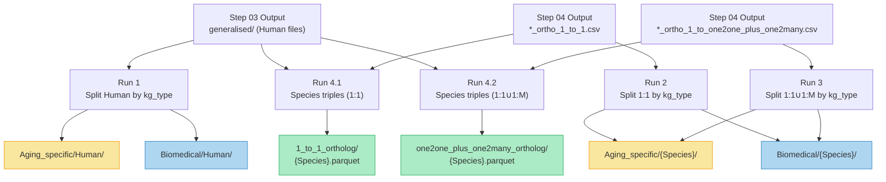

# Step 05 — Making Aging & Biomedical KGs

## 1. Purpose

This is **Step 5** of the EvoAge Knowledge Graph (KG) construction pipeline. The goal is to split the unified processed triples (from Steps 02–04) into two distinct KG categories — **Aging-specific** and **Biomedical (Generalised)** — based on the `kg_type` column assigned during data processing. This split is performed separately for Human data and for each non-human species (using both 1:1 and 1:1∪1:M ortholog-mapped files from Step 04). Additionally, this step generates **Species_AssociatedWith** connection triples that link each species to the genes/entities it is associated with.

---

## 2. Overview

The pipeline has **4 runs** across two phases:

| Phase | Runs | What it does |
|---|---|---|
| **Phase A: KG Splitting** | Run 1, Run 2, Run 3 | Splits every processed triple file into Aging vs Biomedical buckets using the `kg_type` column |
| **Phase B: Species Connections** | Run 4.1, Run 4.2 | Creates `Species_AssociatedWith` triples linking each species to its entities (one file per species) |

### How the `kg_type` classification works

Every triple file from Step 02/03 carries a `kg_type` column with one of these values:

| `kg_type` value | Routed to | Rationale |
|---|---|---|
| `aging` | **Aging only** | Triple comes from an aging-specific database (GenAge, DrugAge, CellAge, etc.) |
| `generalised` | **Biomedical only** | Triple comes from a general biomedical source (PrimeKG, DRKG, STRING, etc.) |
| `aging::generalised` | **Both Aging AND Biomedical** | Triple is relevant to both (e.g., aging genes that also appear in general KGs) |
| blank / other | **Biomedical (default)** | Fallback for any untagged rows |

> [!IMPORTANT]
> Rows tagged `aging::generalised` are copied into **both** the Aging and Biomedical KGs. This ensures the Aging KG contains all aging-relevant context, while the Biomedical KG retains full general coverage.

---

## 3. Pipeline — Step-by-Step

---

### Run 1 — Split Human data by `kg_type`

📄 **Script**: [Run1_split_kg_by_type_human.py](file:///storage/Arushi/090526_EvoAge/kg_formation/DOCUMENTATION/making_aging_biomedical_kg_05/Run1_split_kg_by_type_human.py)

**What it does:**
- Reads all CSV/Parquet files under `processed_data_relation_wise_merge/generalised/` (excluding `OTHER_SPECIES/`)
- For each file, classifies every row by its `kg_type` value into Aging and/or Biomedical
- Saves Aging rows to `Aging_specific/Human/{relation_folder}/` (as Parquet)
- Saves Biomedical rows to `Biomedical/Human/{relation_folder}/` (as Parquet)
- The output directory structure mirrors the source relation-folder hierarchy

**Input:** `processed_data_relation_wise_merge/generalised/{RELATION_TYPE}/ALL_{RELATION_TYPE}.csv|parquet`

**Output:**
- `processed_data_relation_wise_merge/Aging_specific/Human/{RELATION_TYPE}/...parquet`
- `processed_data_relation_wise_merge/Biomedical/Human/{RELATION_TYPE}/...parquet`

**Stats (Human split):**

| KG variant | Total rows |
|---:|---:|
| **Aging** | 1,469,745 |
| **Biomedical** | ~1,118,638,908 |

**Log file:** [Human_KG_SPLIT_LOG.csv](file:///storage/Arushi/090526_EvoAge/kg_formation/processed_data_relation_wise_merge/Human_KG_SPLIT_LOG.csv) (85 relation files processed)

---

### Run 2 — Split 1:1 ortholog files by `kg_type` (other species)

📄 **Script**: [Run2_split_1to1_kg_by_type_otherspecies.py](file:///storage/Arushi/090526_EvoAge/kg_formation/DOCUMENTATION/making_aging_biomedical_kg_05/Run2_split_1to1_kg_by_type_otherspecies.py)

**What it does:**
- For each species, reads only `*_ortho_1_to_1.csv` files (produced by Step 04, Run 3)
- Splits rows by `kg_type` into Aging / Biomedical using the same classification logic as Run 1
- Saves to `Aging_specific/{Species}/{relation}/` and `Biomedical/{Species}/{relation}/` as CSV

**Stats (1:1 ortholog split per species):**

| Species | Aging rows | Biomedical rows |
|---|---:|---:|
| C. elegans | 2,628 | 14,224,088 |
| Drosophila | 773 | 9,587,042 |
| Mouse | 13,632 | 35,411,448 |
| Yeast | 556 | 5,473,742 |
| Zebrafish | 0 | 26,822,373 |

**Log file:** `_OTHER_SPECIES_KG_SPLIT_LOG_1to1.csv`

> [!NOTE]
> Zebrafish has 0 aging rows because none of the Zebrafish source databases were tagged with `aging` kg_type — all Zebrafish data is generalised/biomedical.

---

### Run 3 — Split 1:1∪1:M ortholog files by `kg_type` (other species)

📄 **Script**: [Run3_split_12M_121_comb_kg_by_type_otherspecies.py](file:///storage/Arushi/090526_EvoAge/kg_formation/DOCUMENTATION/making_aging_biomedical_kg_05/Run3_split_12M_121_comb_kg_by_type_otherspecies.py)

**What it does:**
- Identical logic to Run 2, but reads `*_ortho_1_to_one2one_plus_one2many.csv` files (produced by Step 04, Run 5)
- Produces the Aging/Biomedical split for the broader ortholog mapping

**Stats (1:1∪1:M ortholog split per species):**

| Species | Aging rows | Biomedical rows |
|---|---:|---:|
| C. elegans | 2,784 | 15,619,286 |
| Drosophila | 821 | 11,353,141 |
| Mouse | 13,690 | 36,137,837 |
| Yeast | 644 | 6,647,491 |
| Zebrafish | 0 | 27,524,671 |

**Log file:** `_OTHER_SPECIES_KG_SPLIT_LOG.csv`

---

### Run 4 — Generate Species_AssociatedWith connection triples

This run creates a new relation type: **`Species_AssociatedWith`**, which connects each species node to every entity (gene, protein, etc.) it is associated with in the KG. These triples are needed for species-aware link prediction.

#### Run 4.1 — Species triples for the 1:1 ortholog KG

📄 **Script**: [Run_4.1_make_species_triples_1_to_1.py](file:///storage/Arushi/090526_EvoAge/kg_formation/DOCUMENTATION/making_aging_biomedical_kg_05/Run_4_making_species_associatedwith_connection/Run_4.1_1_to_1_ortholog/Run_4.1_make_species_triples_1_to_1.py)

**What it does:**
- Reads **all** Human generalised files + all `*_ortho_1_to_1.csv` files from other species
- For each file, extracts `head_species → Species_AssociatedWith → head` and `tail_species → Species_AssociatedWith → tail` triples
- Deduplicates across all files
- Splits by species and saves one Parquet per species

**Output:** `making_species_assocaitedwithconnection/1_to_1_ortholog/`

| Species | Rows (unique triples) |
|---|---:|
| *Homo sapiens* | 45,409,986 |
| *Mus musculus* | 469,856 |
| *Danio rerio* | 458,424 |
| *Drosophila melanogaster* | 389,611 |
| *Caenorhabditis elegans* | 339,261 |
| *Saccharomyces cerevisiae* | 180,209 |

#### Run 4.2 — Species triples for the 1:1∪1:M ortholog KG

📄 **Script**: [Run_4.2_make_species_triples_combined121_12M.py](file:///storage/Arushi/090526_EvoAge/kg_formation/DOCUMENTATION/making_aging_biomedical_kg_05/Run_4_making_species_associatedwith_connection/Run_4.2_one2one_plus_one2many_ortholog/Run_4.2_make_species_triples_combined121_12M.py)

**What it does:**
- Same logic as Run 4.1, but reads `*_ortho_1_to_one2one_plus_one2many.csv` for other species
- Produces species triples for the broader 1:1∪1:M KG

**Output:** `making_species_assocaitedwithconnection/one2one_plus_one2many_ortholog/`

| Species | Rows (unique triples) |
|---|---:|
| *Homo sapiens* | 45,409,989 |
| *Mus musculus* | 468,107 |
| *Danio rerio* | 451,913 |
| *Drosophila melanogaster* | 387,828 |
| *Caenorhabditis elegans* | 337,691 |
| *Saccharomyces cerevisiae* | 179,451 |

**Triple format:**

```
head              | relation                | tail       | head_type | tail_type
Homo sapiens      | Species_AssociatedWith  | BRCA1      | Species   | Gene
Mus musculus      | Species_AssociatedWith  | TP53       | Species   | Gene
```

---

## 4. Output Directory Structure

```
processed_data_relation_wise_merge/
│
├── Aging_specific/                                      ← Phase A output
│   ├── Human/                                           ← Run 1
│   │   ├── CHEMICALENTITY_GENE/...parquet
│   │   ├── DISEASE_GENE/...parquet
│   │   ├── GENE_DISEASE/...parquet
│   │   └── ... (relation folders mirroring generalised/)
│   ├── Celegans/                                        ← Run 2 + Run 3
│   ├── Drosophila/
│   ├── Mouse/
│   └── Yeast/
│       (note: Zebrafish absent — 0 aging rows)
│
├── Biomedical/                                          ← Phase A output
│   ├── Human/                                           ← Run 1
│   ├── Celegans/                                        ← Run 2 + Run 3
│   ├── Drosophila/
│   ├── Mouse/
│   ├── Yeast/
│   └── Zebrafish/
│
├── making_species_assocaitedwithconnection/              ← Phase B output
│   ├── 1_to_1_ortholog/                                 ← Run 4.1
│   │   ├── Homo_sapiens.parquet
│   │   ├── Mus_musculus.parquet
│   │   ├── Danio_rerio.parquet
│   │   ├── Drosophila_melanogaster.parquet
│   │   ├── Caenorhabditis_elegans.parquet
│   │   ├── Saccharomyces_cerevisiae.parquet
│   │   └── 1_to_1_SUMMARY.csv
│   │
│   └── one2one_plus_one2many_ortholog/                  ← Run 4.2
│       ├── Homo_sapiens.parquet
│       ├── Mus_musculus.parquet
│       ├── ... (same per-species files)
│       └── 1_to_many_SUMMARY.csv
│
├── Human_KG_SPLIT_LOG.csv                               ← Run 1 log
├── _OTHER_SPECIES_KG_SPLIT_LOG_1to1.csv                 ← Run 2 log
└── _OTHER_SPECIES_KG_SPLIT_LOG.csv                      ← Run 3 log
```

---

## 5. Data Flow Diagram



---

## 6. Key Design Decisions

1. **Dual routing for `aging::generalised`**: Triples tagged with both labels are duplicated into both KGs rather than forcing an exclusive split. This ensures the Aging KG is self-contained and evaluable without the Biomedical KG.

2. **Default-to-Biomedical**: Rows with blank or unrecognised `kg_type` values are routed to the Biomedical KG. This is a conservative choice — unlabelled data is assumed to be general rather than aging-specific.

3. **Format conversion (Human)**: Human files are saved as **Parquet** for storage efficiency and faster downstream loading (important given the ~1.1B biomedical rows). Other species files remain as **CSV** for compatibility.

4. **Species_AssociatedWith triples**: These are generated as a distinct relation type to enable species-aware queries and link prediction. The triple `Species → Species_AssociatedWith → Entity` allows the KG to capture which species an entity (gene, protein, etc.) belongs to, critical for cross-species analysis.

5. **Mirrored directory structure**: Output files mirror the source relation-folder hierarchy, making it easy to trace any output file back to its source.

---

## 7. Quick Stats

| Metric | Value |
|---|---:|
| Human relation files processed | 85 |
| Human aging rows | 1,469,745 |
| Human biomedical rows | ~1,118,638,908 |
| Other species (1:1) aging rows | 17,589 |
| Other species (1:1) biomedical rows | ~91,518,693 |
| Other species (1:1∪1:M) aging rows | 17,939 |
| Other species (1:1∪1:M) biomedical rows | ~97,282,426 |
| Species connection triples (1:1) | ~47,247,347 |
| Species connection triples (1:1∪1:M) | ~47,234,979 |
| Output formats | Parquet (Human), CSV (other species) |

---

## 8. Next Step

→ **[Step 06 — Final KG Building](file:///storage/Arushi/090526_EvoAge/kg_formation/DOCUMENTATION/final_kg_building_06)**: Merge all Aging and Biomedical splits across species into the final consolidated KGs for training and evaluation.
