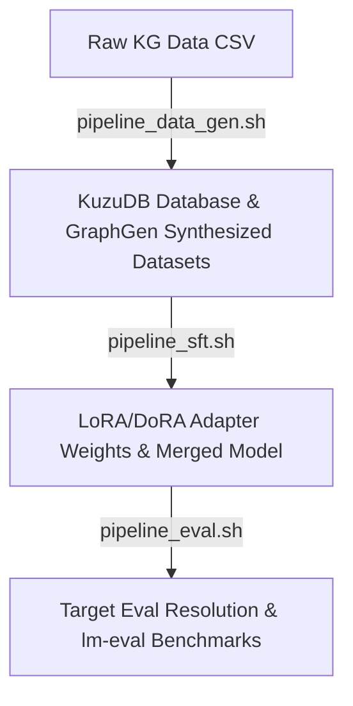

# Fine-tuning and Evaluation of BioMistral LLM
This document provides the complete, end-to-end execution code required to host a local **BioMistral** and **Qwen** endpoints, set up GraphGen, generate datasets from the Aging knowledge graph, and run the Supervised Fine-Tuning (SFT) using LLaMA-Factory. Evaluate the model using QA generated from the held out test set of the knowledge graph and benchmark on several biomedical and clinical datasets.

---

# Environment Setup

### 1 SGLang Environment Setup (Python 3.11)

Create a dedicated Conda environment for serving LLMs with SGLang.


```bash
# Create and activate a new Conda environment
conda create -n vllm3 python=3.11 -y
conda activate vllm3

# Upgrade pip
pip install --upgrade pip

# Install a fixed SGLang version
pip install "sglang[all]==0.5.15.post1"

# Verify the installation
python -c "import sglang; print(sglang.__version__)"
```

## 2. GraphGen Environment Setup


Clone the GraphGen repository and install dependencies in an isolated Python 3.10 environment:
```bash
# Clone the repository and navigate into it
cd pipeline/10_llm_fintunning/GraphGen/

# Create and activate a new Conda environment
conda create -n graphgen python=3.10 -y
conda activate graphgen

# Install dependencies
pip install -r requirements.txt
```

## 3. LLaMA-Factory Environment Setup (Python 3.11+)
Because LLaMA-Factory requires **Python >= 3.11**, you must run it in a separate, isolated environment to avoid python version conflicts with GraphGen:
```bash
# Create and activate a separate conda environment
conda create -n llamafactory python=3.11 -y
conda activate llamafactory

# Clone LLaMA-Factory and install in editable mode
git clone --depth=1 https://github.com/hiyouga/LLaMA-Factory.git
cd LLaMA-Factory
pip install -e .[metrics,bitsandbytes]

# Explicitly install PyTorch inside the conda environment to configure local torchrun
pip install torch

# Fix PATH priority to ensure conda environment binaries (like torchrun) are preferred over system ones:
export PATH="/path/to/miniconda3/envs/llamafactory/bin:$PATH"
```


---


# LLM Build and Evaluation Process

This part of the document outlines the complete end-to-end process followed to construct, fine-tune, evaluate, and deploy the specialized **BioMistral LLM** for the **EvoAge** platform. 

The primary goal of this project was to train BioMistral to ingest aging-related data from the Knowledge Graph (KG) without losing the model's general medical, clinical, and anatomical intelligence.

---

## 1. Process Overview & Architecture

The workflow consists of three main automated scripts mapping to five distinct steps:



### Models Utilized
*   **Trainee Model (To be fine-tuned):** `BioMistral/BioMistral-7B`
*   **Synthesizer:** `Qwen/Qwen3-14B-FP8`

---

## 2. pipeline_data_gen.sh

This script runs the Knowledge Graph preparation and the question-answer dataset synthesis:

### Knowledge Graph (KG) Preparation & Ingestion
*   **Preprocessing:** Preprocesses raw interactions from `Aging_1_to_many_forfinetune_updated_training.csv` via `load_kuzu.py`. Formats names and prefixes entities with `id (detail_name)`, normalizes edge relationships (e.g. converting types to `"inhibits"`, `"promotes"`, or `"has no effect on"`), and tracks species orthologies.
*   **Ingestion:** Writes node and edge dataframes to compressed Parquet files (`nodes_tmp.parquet`, `edges_tmp.parquet`) and ingests them into KuzuDB with a strict buffer pool limit (10 GB) to manage RAM.

### Question-Answer Dataset Generation (GraphGen)
*   **SGLang Server Startup:** Launches the Trainee model (`BioMistral-7B` on port 30000) and the Synthesizer model (`Qwen3-14B-FP8` on port 30001) in the background, polling their status until healthy.
*   **GraphGen Execution:** Runs the GraphGen pipeline (`custom_kuzu_qa.yaml`) using the running servers to extract graph structures, assess model gaps via quizzes/judgments, sample high-loss neighborhoods, and generate synthetic QA pairs (Atomic QA, Aggregated QA, Multi-Hop QA) with style diversification.
*   **Dataset Registration:** Copies generated `.jsonl` files to `LLaMA-Factory/data/`, registers them dynamically inside `dataset_info.json`, and updates `biomistral_lora_sft_optimized4.yaml` with the registered keys via `register_datasets.py`.

### How to Run
```bash
./pipeline_data_gen.sh
```

---

## 3. pipeline_sft.sh

This script runs the model training using LLaMA-Factory, weight merging, and post-export patches.

### Supervised Fine-Tuning (SFT) & Model Export
*   **Configurations:** Compares training hyperparameters to balance graph learning and clinical reasoning preservation:
    *   *Model 1 (`biomistral_lora_sft_optimized3.yaml`):* Rank 64, Alpha 128, LR `2e-4`, packing enabled. Led to catastrophic MMLU degradation (-14.5%) due to overfitting.
    *   *Aging_BioMistral_finetuned (`biomistral_lora_sft_optimized4.yaml`):* Rank 16, Alpha 32, LR `5e-5`, MLP+Attention target, packing disabled. Achieved combined graph loss `0.136` while maintaining medical benchmark accuracy.
*   **Fine-Tuning:** Initiates SFT training using `llamafactory-cli train` pointing to the balanced YAML config.
*   **Weight Merge & Export:** Consolidates base model weights and adapter weights, exporting the merged model to `models/BioMistral-Finetuned4`.
*   **Tokenizer Patching:** Fixes the serialization issue in `models/BioMistral-Finetuned4/tokenizer_config.json` by replacing empty `"extra_special_tokens"` lists with empty JSON objects to ensure vLLM/SGLang loader compatibility.

### How to Run
```bash
./pipeline_sft.sh
```

---

## 4. pipeline_eval.sh

This script runs the multi-dimensional evaluation suite, measuring target factual retention and general medical benchmark performance.

### Target Domain Evaluation (KG Test Triples)
*   **Test Ingestion:** Ingests normalized test triples from `Aging_1_to_many_forfinetune_updated_test2.csv` into a dedicated test graph namespace (`cache/graph_test_kuzu`) via `load_kuzu_test.py` to prevent train-test contamination.
*   **GraphGen Test Run:** Launches SGLang servers (Finetuned model on port 30000, Qwen synthesizer on port 30001) and executes GraphGen test pipeline (`test_evaluate.yaml`), logging predictions to `cache/output/test_evaluation_finetuned`.
*   **Answer Resolution:** Executes `resolve_kg_evaluation.py` on the output. It runs a local fast rule-based parser (Pass 1) for prefix exact matching (e.g. true/yes/correct vs false/no/wrong) and routes failures to a parallel LLM judge thread pool (Pass 2) querying the Qwen synthesizer server. Compiles multi-part JSONL Ray chunks to a single CSV `judge_results_resolved.csv` automatically if a directory input is passed.

### Foundational Medical & Clinical Evaluation (lm-eval)
*   **lm-eval Benchmarking:** Launches the fine-tuned model on port 50000, activates the `lm-eval` environment, and runs task benchmarks (`medmcqa`, `pubmedqa`, clinical anatomy, biology, genetics, etc.) via local completions. Cleanly shuts down the server upon completion.

### How to Run
```bash
./pipeline_eval.sh
```


## 5. QA Generation Prompt Templates

The synthetic QA generation step inside `pipeline_data_gen.sh` (GraphGen execution) is driven by four prompt template modules. 

### 5.1 True/False Generation — `true_false_generation.py`

```python
TEMPLATE_TF_EN: str = """You are an expert biomedical dataset generator.

IMPORTANT RULES:

1. ONLY use information explicitly present in the context
2. DO NOT use external biological knowledge
3. DO NOT complain about missing context
4. DO NOT explain limitations
5. DO NOT hallucinate relationships
6. DO NOT generate chain-of-thought
7. DO NOT output <think>
8. Contexts may contain ONLY entity names or short relations
9. If context is minimal, create simple factual statements directly from it
10. Output ONLY XML

TASK:
Generate {num_of_questions} independent FALSE biomedical questions.

QUESTION REQUIREMENTS:
- Questions must be self-contained
- Questions must be directly derived from the context
- Questions must be concise
- Questions must be factual
- No explanations

OUTPUT FORMAT:

<question>Question text</question>
<answer>True</answer>


CONTEXT:
{context}

OUTPUT:
"""


TF_GENERATION_PROMPT = {"zh": TEMPLATE_TF_EN, "en": TEMPLATE_TF_EN}
```

### 5.2 Atomic (Single-Hop) Generation — `atomic_generation.py`

```python
TEMPLATE_EN: str = """You are an expert Knowledge Graph data generation engine. Your task is to generate a high-quality, atomic (single-step) reasoning question and answer (QA) pair based strictly on the provided knowledge subgraph. This data will be used to train advanced fine-tuning models.

Please note the following requirements:
1. [Strict Grounding]: Output only one QA pair without any additional explanations or analysis. The answer must be strictly derived from the provided subgraph. Do not hallucinate facts.
2. [Atomic Reasoning]: The question should focus on a direct, single-step relationship between entities within the subgraph.
3. [XML Tag Isolation]: You MUST wrap your generated question exactly in <question>...</question> tags and your generated answer exactly in <answer>...</answer> tags. Do not stop generating until both closing tags are successfully output.

For example:
Input:
- BCR-ABL1: BCR-ABL1 (Entity Type: Gene)
- Chronic Myeloid Leukemia: Chronic Myeloid Leukemia (Entity Type: Disease)
- BCR-ABL1-[drives]->Chronic Myeloid Leukemia: BCR-ABL1 drives Chronic Myeloid Leukemia. (Interaction type: pathogenesis)

Output:
<question>Which specific gene's abnormal expression is known to drive the pathogenesis of Chronic Myeloid Leukemia?</question>
<answer>BCR-ABL1</answer>

Here is the knowledge subgraph you need to generate a QA pair for:
{context}

Output:
"""
```

### 5.3 Multi-Hop Generation — `multi_hop_generation.py`

```python
TEMPLATE_EN: str = """You are an expert Knowledge Graph data generation engine. Your task is to generate a high-quality, multi-hop reasoning question and answer pair based strictly on the provided knowledge subgraph. This data will be used to train advanced fine-tuning models.

The provided subgraph contains specific entities and the relations connecting them.

You MUST strictly adhere to the following constraints:
1. [Strict Grounding]: The answer must be logically derived entirely from the provided subgraph. You are strictly forbidden from introducing external prior knowledge or hallucinating facts.
2. [Deep Multi-Hop Reasoning]: The question cannot be a simple, single-step lookup. It must force the reader to traverse a chain of at least two or more entities and relations to arrive at the answer.
3. [Format Purity]: Output exactly one QA pair. Do not include any preambles, explanations, structural breakdowns, or extra text like "Here is your question."
4. [XML Tag Isolation]: You MUST wrap your generated question exactly in <question>...</question> tags and your generated answer exactly in <answer>...</answer> tags. Do not stop generating until both closing tags are successfully output.

Example:
Input:
--Entities--
1. Imatinib
2. BCR-ABL1
3. Chronic Myeloid Leukemia
--Relations--
1. Imatinib-[inhibits]->BCR-ABL1: Imatinib is an inhibitor that targets BCR-ABL1.
2. BCR-ABL1-[drives]->Chronic Myeloid Leukemia: The abnormal expression of BCR-ABL1 drives the pathogenesis of Chronic Myeloid Leukemia.

Output:
<question>Which specific hematological malignancy is treated by administering a drug that targets and inhibits the BCR-ABL1 kinase?</question>
<answer>Chronic Myeloid Leukemia</answer>

Real input:
--Entities--
{entities}
--Relations--
{relationships}

Output:
"""
```

### 5.4 Aggregated Generation — `aggregated_generation.py`

```python
ANSWER_REPHRASING_CONTEXT_EN: str = """---Role---
You are an NLP expert responsible for generating a logically structured and coherent narrative summary based strictly on the biomedical ENTITIES and RELATIONSHIPS provided below. You may refer to the original text to assist in generating the rephrased version, but ensure that the final output text meets the requirements.
Use English as output language.

---Goal---
To generate a coherent, paragraph-length narrative that accurately conveys the relationships in the biological subgraph.
1. Use professional biomedical terminology.
2. Ensure temporal and causal relationships (like upregulation, inhibition, pathogenesis) are logically described.
3. Combine multiple interactions into a fluid, cohesive summary rather than a bulleted list.

################
-ORIGINAL TEXT-
################
{original_text}

################
-ENTITIES-
################
{entities}

################
-RELATIONSHIPS-
################
{relationships}

"""

ANSWER_REPHRASING_EN: str = """---Role---
You are an NLP expert responsible for generating a logically structured and coherent narrative summary based strictly on the biomedical ENTITIES and RELATIONSHIPS provided below.
Use English as output language.

---Goal---
To generate a coherent, paragraph-length narrative that accurately conveys the relationships in the biological subgraph.
1. Use professional biomedical terminology.
2. Ensure temporal and causal relationships (like upregulation, inhibition, pathogenesis) are logically described.
3. Combine multiple interactions into a fluid, cohesive summary rather than a bulleted list.

**Attention: Please directly provide the summary text without any additional content or analysis.**

################
-ENTITIES-
################
{entities}

################
-RELATIONSHIPS-
################
{relationships}

"""

REQUIREMENT_EN = """
################
Please directly output the coherent rephrased narrative text below, without any additional content.

Output format:
<rephrased_text>rephrased_text_here</rephrased_text>

Rephrased Text:
"""

QUESTION_GENERATION_EN: str = """You are an expert Knowledge Graph data generation engine. You are provided with a biomedical narrative (answer). Please generate a comprehensive question that would elicit this exact paragraph as the answer.

The narrative paragraph (answer) is as follows:
<answer>{answer}</answer>

Please note the following requirements:
1. [Strict Grounding]: Only output one question text without any additional explanations or analysis.
2. [Format Purity]: Do not repeat the content of the answer or any fragments of it.
3. [XML Tag Isolation]: You MUST wrap your generated question exactly in <question>...</question> tags.

Output format:
<question>question_text</question>

Question:
"""

AGGREGATED_GENERATION_PROMPT = {
    "en": {
        "ANSWER_REPHRASING": ANSWER_REPHRASING_EN + REQUIREMENT_EN,
        "ANSWER_REPHRASING_CONTEXT": ANSWER_REPHRASING_CONTEXT_EN + REQUIREMENT_EN,
        "QUESTION_GENERATION": QUESTION_GENERATION_EN,
    },
}
```
