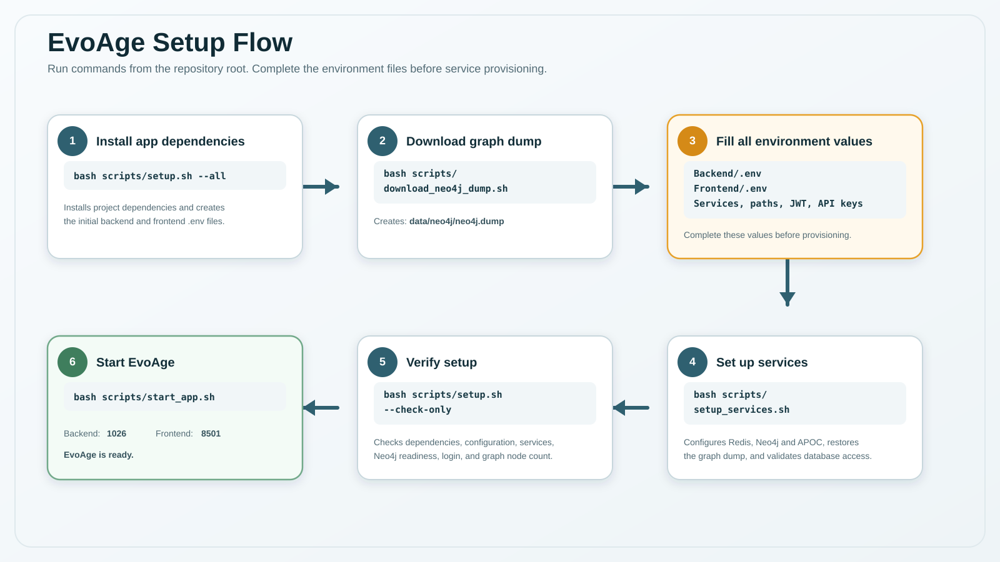

# EvoAge Shell Setup Flow



This folder contains helper scripts for setting up EvoAge with fewer manual commands while keeping verification checks visible.

Run every command from the repository root. Do not run these scripts with `sudo bash`; run them as a normal user. Scripts that need system-level access call `sudo` internally and your terminal will ask for the sudo password at that point.

## Quick Command Sequence

```bash
bash scripts/setup.sh --all
bash scripts/download_evoage_artifacts.sh

# Fill all required values in Backend/.env and Frontend/.env.
# Choose either USE=gemini or USE=medgemma in Backend/.env.

# Optional local MedGemma path only. First accept access on the MedGemma page.
# MEDGEMMA_HF_TOKEN=YOUR_HF_READ_TOKEN bash scripts/setup_medgemma.sh

bash scripts/setup_services.sh
bash scripts/setup.sh --check-only
bash scripts/start_app.sh
```

## What Each Step Does

### 1. Prepare Python environments and `.env` files

```bash
bash scripts/setup.sh --all
```

This creates or checks the backend and frontend conda environments, installs Python dependencies, and creates these files from the templates if they do not already exist:

- `Backend/.env`
- `Frontend/.env`

The first run can print warnings for missing Neo4j, Redis, JWT, model-path, or API-key values. That is expected before the dump, services, and model artifacts are configured.

### 2. Download EvoAge data artifacts

```bash
bash scripts/download_evoage_artifacts.sh
```

The script downloads the Neo4j dump tarball and the DGL-EvoKG model artifacts from the EvoAge Hugging Face dataset:

```text
https://huggingface.co/datasets/gauravahuja77/EvoAge/tree/main
https://huggingface.co/datasets/gauravahuja77/EvoAge/tree/main/DGL-EvoKG
```

Default output:

```text
data/neo4j/neo4j.dump.tar.gz
data/neo4j/neo4j.dump
Backend/DGL-EvoKG/Model/
Backend/DGL-EvoKG/Node_Mapping/
```

The Neo4j dump still uses resumable download flags for `curl` or `wget`. DGL-EvoKG artifacts are downloaded with the Hugging Face CLI through the backend conda environment and are placed directly into the root README layout, so no file moving is needed.

Useful variants:

```bash
bash scripts/download_evoage_artifacts.sh --skip-dgl
bash scripts/download_evoage_artifacts.sh --skip-neo4j
```

### 3. Fill all required `.env` values

After the dump and DGL-EvoKG artifacts are ready, fill `Backend/.env` and `Frontend/.env` once. `setup_services.sh` uses the service values and also does checks.

For both local installs and SSH/server installs where Neo4j and Redis run on the same machine as the backend, keep database services private on `localhost`:

**Database Services**
```env
NEO4J_URI=neo4j://localhost:7687
NEO4J_USERNAME=neo4j
NEO4J_PASSWORD=YOUR_NEO4J_PASSWORD

REDIS_HOST=localhost
REDIS_PORT=6379
REDIS_USERNAME=default
REDIS_PASSWORD=YOUR_REDIS_PASSWORD
```

Use the server IP or domain only for the backend/frontend app URLs that users open from a browser:

```env
API_BASE=http://SERVER_IP_OR_DOMAIN:1026
FRONTEND_URL=http://SERVER_IP_OR_DOMAIN:8501
```

In `Frontend/.env`, set:

```env
API_BASE_URL=http://SERVER_IP_OR_DOMAIN:1026
```

For **local-only testing**, use `localhost` for the app URLs too:

```env
API_BASE=http://localhost:1026
FRONTEND_URL=http://localhost:8501
API_BASE_URL=http://localhost:1026
```


Also fill the remaining backend values before moving on:

- DGL-EvoKG root/model/data paths
- DGL/DGL-KE input and dummy-list paths
- hypothesis-testing paths
- JWT secret
- Email settings if using email or reset-password features

### Choose one LLM provider:

```env
USE=gemini
GEMINI_API_KEY=YOUR_GEMINI_API_KEY
GEMINI_MODEL=gemini-2.5-flash-lite
```

Or, for local control with MedGemma:

```env
USE=medgemma
MEDGEMMA_BASE_URL=http://localhost:30001/v1
MEDGEMMA_MODEL=medgemma-27b-local
```

If you use Gemini, skip the MedGemma setup and continue directly to service setup.

If you use [MedGemma](https://huggingface.co/google/medgemma-27b-text-it), run the MedGemma setup script in another terminal from the same repository root:

> **Warning:** MedGemma 27B needs roughly 60GB VRAM; an 80GB GPU is recommended. If you do not have enough GPU memory, use `USE=gemini` with the Gemini API instead.
>
> Keep the MedGemma/SGLang server process running while the backend uses `USE=medgemma`. Continue the remaining setup/startup commands from a separate terminal in the same repo.

`google/medgemma-27b-text-it` is a gated repository. Accept the licence on the model [page](https://huggingface.co/google/medgemma-27b-text-it) with your Hugging Face account, wait for approval if required, then use a `read token` and run the command with the token:

```bash
MEDGEMMA_HF_TOKEN=YOUR_HF_READ_TOKEN bash scripts/setup_medgemma.sh
```

This script creates/checks the `sglang` conda environment, installs SGLang and the Hugging Face CLI, downloads `google/medgemma-27b-text-it` into `Backend/medgemma-27b-local`, and starts the local SGLang server. The model server can take time to load.


The `start_app.sh` script checks these DGL-EvoKG artifacts before launching the backend:

- `MODEL_PATH`
- `MODEL_PATH/config.json`
- `ENT_DICT_PATH`
- `REL_DICT_PATH`
- `NODE_MAPPINGS_PATH`
- `DGLKE_DUMMY_HEAD_LIST`
- `DGLKE_DUMMY_REL_LIST`

The artifact downloader places the DGL-EvoKG files directly under `Backend/DGL-EvoKG/`:

```text
https://huggingface.co/datasets/gauravahuja77/EvoAge/tree/main/DGL-EvoKG
```

Set `ROOT_DIR_PATH` in `Backend/.env` to the directory containing `Model/`, `Node_Mapping/`, and `Dummy_Input/`, for example `Backend/DGL-EvoKG` or its absolute path.

### 4. Install/configure Redis and Neo4j, then restore the dump

```bash
bash scripts/setup_services.sh
```

This script reads service values from `Backend/.env`, syncs app URLs into both `.env` files, installs/configures Redis and Neo4j, installs APOC, restores the graph dump, repairs Neo4j permissions, restarts services, and verifies service connectivity.

It intentionally checks only the values needed for Redis and Neo4j setup. The full `.env` validation happens in the next step.

By default it uses:

```text
data/neo4j/neo4j.dump
```

Use a custom dump path when needed:

```bash
bash scripts/setup_services.sh --dump /path/to/neo4j.dump
```

Useful variants:

```bash
bash scripts/setup_services.sh --skip-neo4j
bash scripts/setup_services.sh --skip-redis
bash scripts/setup_services.sh --dry-run
```

### 5. Run final setup checks

```bash
bash scripts/setup.sh --check-only
```

This does not reinstall dependencies and does not start the app. It validates required `.env` values, service connectivity, conda environments, imports, and configured URLs.

If backend/frontend URLs are not reachable during `--check-only`, that is expected before the app is started. The next step starts those processes.

### 6. Start backend and frontend

```bash
bash scripts/start_app.sh
```

This starts the backend and frontend in the background, writes logs/PID files, prints URLs, and checks whether the URLs become reachable.

#### Blackwell GPU / CUDA compatibility note

The default backend dependency setup should work on regular supported CUDA GPUs. NVIDIA Blackwell GPUs, such as RTX PRO 5000 or newer 50-series cards, report compute capability `sm_120` and need a PyTorch build with CUDA 12.8+ support.

If backend startup fails with `CUDA error: no kernel image is available for execution on the device`, reinstall PyTorch inside the backend environment with a CUDA 12.8+ wheel, then restart the app:

```bash
conda run -n evoage_backend python -m pip install --upgrade --force-reinstall torch torchvision torchaudio --index-url https://download.pytorch.org/whl/cu128
bash scripts/start_app.sh --restart
```

`start_app.sh` prints a warning when it detects a Blackwell GPU with a PyTorch build that does not include `sm_120` CUDA kernels.

Runtime defaults:

- Backend printed/checked URL comes from `Frontend/.env` `API_BASE_URL`, then `Backend/.env` `API_BASE`.
- Frontend printed/checked URL comes from `Backend/.env` `FRONTEND_URL`.
- If both localhost and server-IP values exist, the server-IP URL is preferred for display/checks.
- If values are missing/placeholders, fallbacks are `http://localhost:1026` and `http://localhost:8501`.
- If the server-IP URL fails but localhost works, the app is running and the remaining issue is network, firewall, DNS, or port exposure.

Useful commands:

```bash
bash scripts/start_app.sh --restart
bash scripts/start_app.sh --stop
bash scripts/start_app.sh --backend-only
bash scripts/start_app.sh --frontend-only
bash scripts/setup.sh --check-only
```
