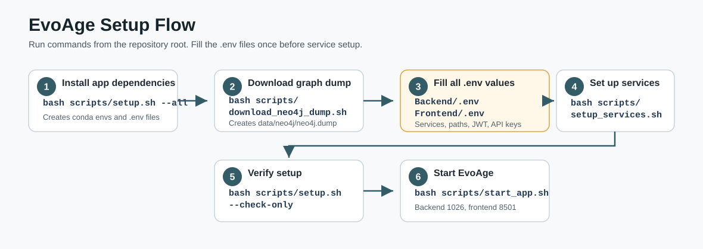

# EvoAge Shell Setup Flow



This folder contains helper scripts for setting up EvoAge with fewer manual commands while keeping verification checks visible.

Run every command from the repository root. Do not run these scripts with `sudo bash`; run them as a normal user. Scripts that need system-level access call `sudo` internally and your terminal will ask for the sudo password at that point.

## Quick Command Sequence

```bash
bash scripts/setup.sh --all
bash scripts/download_neo4j_dump.sh

# Fill all required values in Backend/.env and Frontend/.env.

bash scripts/setup_services.sh
bash scripts/setup.sh --check-only
bash scripts/start_app.sh
```

## What Each Step Does

### 1. Prepare Python environments and `.env` files

```bash
bash scripts/setup.sh --all
```

This creates or checks the backend and frontend conda environments, installs Python dependencies, and creates these files from the templates if they do not already exist:

- `Backend/.env`
- `Frontend/.env`

The first run can print warnings for missing Neo4j, Redis, JWT, model-path, or API-key values. That is expected before the dump, services, and model artifacts are configured.

### 2. Download and extract the Neo4j dump

```bash
bash scripts/download_neo4j_dump.sh
```

The script downloads the Neo4j dump tarball from the EvoAge Hugging Face dataset:

```text
https://huggingface.co/datasets/gauravahuja77/EvoAge/tree/main
```

Default output:

```text
data/neo4j/neo4j.dump.tar.gz
data/neo4j/neo4j.dump
```

The script uses resumable download flags for `curl` or `wget`. If a resumed download or extraction fails, remove the incomplete file under `data/neo4j/` and rerun the same command.

### 3. Fill all required `.env` values

After the dump is ready, fill `Backend/.env` and `Frontend/.env` once. `setup_services.sh` uses the service values, and `setup.sh --check-only` verifies the full application configuration before startup.

For both local installs and SSH/server installs where Neo4j and Redis run on the same machine as the backend, keep database services private on `localhost`:

```env
NEO4J_URI=neo4j://localhost:7687
NEO4J_USERNAME=neo4j
NEO4J_PASSWORD=YOUR_NEO4J_PASSWORD

REDIS_HOST=localhost
REDIS_PORT=6379
REDIS_USERNAME=default
REDIS_PASSWORD=YOUR_REDIS_PASSWORD
```

Use the server IP or domain only for the backend/frontend app URLs that users open from a browser:

```env
API_BASE=http://SERVER_IP_OR_DOMAIN:1026
FRONTEND_URL=http://SERVER_IP_OR_DOMAIN:8501
```

In `Frontend/.env`, set:

```env
API_BASE_URL=http://SERVER_IP_OR_DOMAIN:1026
```

For local-only testing, use `localhost` for the app URLs too:

```env
API_BASE=http://localhost:1026
FRONTEND_URL=http://localhost:8501
API_BASE_URL=http://localhost:1026
```

Recommended SSH/server connectivity:

```text
User browser
  -> http://SERVER_IP_OR_DOMAIN:8501
  -> Streamlit frontend on the server
  -> http://SERVER_IP_OR_DOMAIN:1026
  -> FastAPI backend on the server
  -> neo4j://localhost:7687
  -> Neo4j on the same server

FastAPI backend
  -> localhost:6379
  -> Redis on the same server
```

This exposes only the frontend/backend app ports. Neo4j and Redis stay internal unless you intentionally configure them otherwise.

Also fill the remaining backend values before moving on:

- DGL-EvoKG root/model/data paths
- DGL/DGL-KE input and dummy-list paths
- hypothesis-testing paths
- JWT secret
- LLM/API key settings
- email settings if using email or reset-password features

The start script checks these DGL-EvoKG artifacts before launching the backend:

- `MODEL_PATH`
- `MODEL_PATH/config.json`
- `ENT_DICT_PATH`
- `REL_DICT_PATH`
- `NODE_MAPPINGS_PATH`
- `DGLKE_DUMMY_HEAD_LIST`
- `DGLKE_DUMMY_REL_LIST`

Download or copy the required DGL-EvoKG artifacts from:

```text
https://huggingface.co/datasets/gauravahuja77/EvoAge/tree/main
```

Then set `ROOT_DIR_PATH` in `Backend/.env` to the directory containing `Model/`, `Node_Mapping/`, and `Dummy_Input/`.

### 4. Install/configure Redis and Neo4j, then restore the dump

```bash
bash scripts/setup_services.sh
```

This script reads service values from `Backend/.env`, syncs app URLs into both `.env` files, installs/configures Redis and Neo4j, installs APOC, restores the graph dump, repairs Neo4j permissions, restarts services, and verifies service connectivity.

It intentionally checks only the values needed for Redis and Neo4j setup. The full `.env` validation happens in the next step.

By default it uses:

```text
data/neo4j/neo4j.dump
```

Use a custom dump path when needed:

```bash
bash scripts/setup_services.sh --dump /path/to/neo4j.dump
```

Useful variants:

```bash
bash scripts/setup_services.sh --skip-neo4j
bash scripts/setup_services.sh --skip-redis
bash scripts/setup_services.sh --dry-run
```

If Neo4j starts but queries fail with `AccessDeniedException` under `/var/lib/neo4j/data`, repair ownership manually:

```bash
sudo systemctl stop neo4j
sudo chown -R neo4j:neo4j /var/lib/neo4j/data
sudo chown -R neo4j:neo4j /var/lib/neo4j/plugins
sudo chmod -R u+rwX,g+rX /var/lib/neo4j/data
sudo systemctl start neo4j
```

Then test:

```bash
cypher-shell -a bolt://localhost:7687 -u neo4j -p 'YOUR_NEO4J_PASSWORD' "SHOW DATABASES;"
```

If `/etc/neo4j/neo4j.conf` uses a custom `server.directories.data` or `server.directories.plugins`, run the same ownership commands on those configured paths instead. The script detects those configured paths and fixes them automatically during setup.

### 5. Run final setup checks

```bash
bash scripts/setup.sh --check-only
```

This does not reinstall dependencies and does not start the app. It validates required `.env` values, service connectivity, conda environments, imports, and configured URLs.

If backend/frontend URLs are not reachable during `--check-only`, that is expected before the app is started. The next step starts those processes.

### 6. Start backend and frontend

```bash
bash scripts/start_app.sh
```

This starts the backend and frontend in the background, writes logs/PID files, prints URLs, and checks whether the URLs become reachable.

Runtime defaults:

- Backend printed/checked URL comes from `Frontend/.env` `API_BASE_URL`, then `Backend/.env` `API_BASE`.
- Frontend printed/checked URL comes from `Backend/.env` `FRONTEND_URL`.
- If both localhost and server-IP values exist, the server-IP URL is preferred for display/checks.
- If values are missing/placeholders, fallbacks are `http://localhost:1026` and `http://localhost:8501`.
- If the server-IP URL fails but localhost works, the app is running and the remaining issue is network, firewall, DNS, or port exposure.

Useful commands:

```bash
bash scripts/start_app.sh --restart
bash scripts/start_app.sh --stop
bash scripts/start_app.sh --backend-only
bash scripts/start_app.sh --frontend-only
bash scripts/setup.sh --check-only
```
